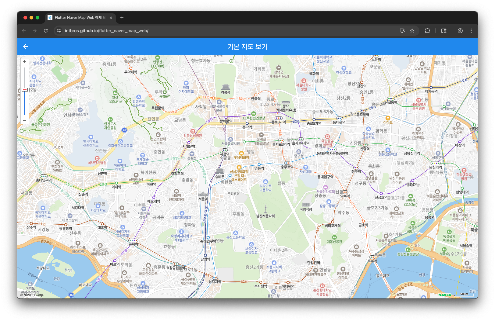

# Flutter Naver Map Web

네이버 지도 API와의 원활한 통합을 제공하는 Flutter Web 패키지입니다.
**Flutter Naver Map Web**은 네이버 지도 JavaScript API v3을 임베드하여 Flutter Web에서 위젯으로 사용할 수 있게 만들어진 라이브러리입니다. 오직 Flutter Web 빌드로만 사용할 수 있으며, 현재 자주 사용되는 기능들이 구현되어 있고 지속적으로 업데이트할 예정입니다.

NAVER 지도 API v3는 JavaScript 형태의 NAVER 지도 플랫폼으로, 네이버 지도 공식 홈페이지([https://navermaps.github.io/maps.js.ncp/docs/index.html](https://navermaps.github.io/maps.js.ncp/docs/index.html))에서 확인하실 수 있습니다.

**NAVER 지도 API v3의 모든 저작권은 네이버에 있습니다.**
**참고: 이 패키지는 Flutter Web 전용으로 설계되었으며 모바일 플랫폼(iOS/Android)을 지원하지 않습니다.**

## 🌐 라이브 데모

실제 작동하는 예제를 확인하고 싶으시다면 라이브 데모를 방문해보세요:

**[🚀 라이브 데모 보기](https://intbros.github.io/flutter_naver_map_web/)**
https://intbros.github.io/flutter_naver_map_web/



데모에서는 다음과 같은 기능들을 직접 체험할 수 있습니다:

- 기본 지도 표시
- 마커 클릭 이벤트
- 여러 마커 관리
- 지도 컨트롤 기능


## ✨ 주요 기능

- 🗺️ **인터랙티브 네이버 지도**: 부드러운 상호작용이 가능한 고성능 지도 위젯
- 📍 **동적 마커 관리**: 마커 추가, 제거, 업데이트 및 커스텀 아이콘 지원
- 💬 **정보창(InfoWindow)**: HTML 콘텐츠를 지원하는 풍부한 정보 표시 기능
- 🎯 **지도 컨트롤**: 줌, 팬, 경계 조정 등 포괄적인 지도 제어 기능
- 🔧 **타입 안전성**: 최신 `dart:js_interop`을 사용한 견고한 JavaScript 통합
- 🌐 **웹 최적화**: Flutter Web 환경에 특화되어 설계 및 최적화
- 🚀 **간편한 통합**: 네이버 클라우드 플랫폼 클라이언트 ID만으로 쉬운 설정
- 📱 **반응형**: 다양한 화면 크기와 방향에 자동 적응

## 🔧 설치 방법

### 1. 의존성 추가

`pubspec.yaml` 파일에 패키지를 추가하세요:

```yaml
dependencies:
  flutter_naver_map_web: ^0.0.1
```

그 다음 명령어를 실행하세요:
```bash
flutter pub get
```

### 2. 네이버 클라우드 플랫폼 클라이언트 ID 발급

1. [네이버 클라우드 플랫폼](https://www.ncloud.com/)에 가입
2. Application 메뉴에서 Maps 선택
3. 서비스 신청
4. "Web Dynamic Map" 선택
5. 인증 정보에서 클라이언트 ID 확인

### 3. Flutter 앱에서 사용

HTML 파일에 스크립트를 추가할 필요가 없습니다! NaverMapWeb 위젯에 클라이언트 ID를 직접 전달하기만 하면 됩니다.

## 📖 사용법

### 기본 예제

```dart
import 'package:flutter/material.dart';
import 'package:flutter_naver_map_web/flutter_naver_map_web.dart';

class NaverMapExample extends StatelessWidget {
  @override
  Widget build(BuildContext context) {
    return Scaffold(
      appBar: AppBar(title: Text('네이버 지도 예제')),
      body: NaverMapWeb(
        clientId: 'YOUR_CLIENT_ID',  // 실제 클라이언트 ID로 변경
        initialLatitude: 37.5666103,  // 서울시청
        initialLongitude: 126.9783882,
        initialZoom: 15,
        zoomControl: true,
        mapDataControl: true,
        places: [
          Place(
            id: '1',
            name: '서울시청',
            latitude: 37.5666103,
            longitude: 126.9783882,
            description: '서울특별시청',
            category: '관공서',
          ),
        ],
        onMapReady: (NaverMap map) {
          print('지도가 준비되었습니다!');
        },
        onMarkerClick: (Place place) {
          print('마커 클릭: ${place.name}');
        },
      ),
    );
  }
}
```

### 여러 마커 표시 예제

```dart
class MapWithMultipleMarkers extends StatefulWidget {
  @override
  _MapWithMultipleMarkersState createState() => _MapWithMultipleMarkersState();
}

class _MapWithMultipleMarkersState extends State<MapWithMultipleMarkers> {
  String? selectedPlaceId;
  
  final List<Place> places = [
    Place(
      id: '1',
      name: '서울시청',
      latitude: 37.5666103,
      longitude: 126.9783882,
      description: '서울특별시의 행정 중심지',
      category: '관공서',
    ),
    Place(
      id: '2', 
      name: '경복궁',
      latitude: 37.5796,
      longitude: 126.9770,
      description: '조선시대의 정궁',
      category: '관광지',
    ),
    Place(
      id: '3',
      name: 'N서울타워',
      latitude: 37.5512,
      longitude: 126.9882,
      description: '서울의 상징적 랜드마크',
      category: '관광지',
    ),
  ];
  
  @override
  Widget build(BuildContext context) {
    return NaverMapWeb(
      clientId: 'YOUR_CLIENT_ID',
      initialLatitude: 37.5666103,
      initialLongitude: 126.9783882,
      initialZoom: 12,
      places: places,
      selectedPlaceId: selectedPlaceId,
      onMarkerClick: (Place place) {
        setState(() {
          selectedPlaceId = place.id;
        });
      },
    );
  }
}
```

## 📚 API 레퍼런스

### NaverMapWeb 매개변수

| 매개변수 | 타입 | 필수 | 기본값 | 설명 |
|---------|------|------|--------|------|
| `clientId` | `String` | ✅ | - | 네이버 클라우드 플랫폼 클라이언트 ID |
| `initialLatitude` | `double` | ❌ | `37.5666103` | 초기 지도 중심 위도 |
| `initialLongitude` | `double` | ❌ | `126.9783882` | 초기 지도 중심 경도 |
| `initialZoom` | `int` | ❌ | `15` | 초기 줌 레벨 (1-21) |
| `zoomControl` | `bool` | ❌ | `true` | 줌 컨트롤 버튼 표시 |
| `mapDataControl` | `bool` | ❌ | `true` | 지도 데이터 컨트롤 표시 |
| `places` | `List<Place>` | ❌ | `[]` | 마커로 표시할 장소 목록 |
| `selectedPlaceId` | `String?` | ❌ | `null` | 현재 선택된 장소 ID |
| `markerSize` | `Size?` | ❌ | `Size(30, 40)` | 기본 마커 크기 |
| `selectedMarkerSize` | `Size?` | ❌ | `Size(40, 50)` | 선택된 마커 크기 |
| `onMapReady` | `Function(NaverMap)?` | ❌ | `null` | 지도 준비 완료 콜백 |
| `onMarkerClick` | `Function(Place)?` | ❌ | `null` | 마커 클릭 콜백 |

### Place 모델

`Place` 클래스는 마커 정보가 포함된 위치를 나타냅니다:

```dart
Place({
  required String id,           // 고유 식별자
  required String name,         // 표시명
  required double latitude,     // 위도 좌표
  required double longitude,    // 경도 좌표
  String? description,          // 정보창 설명 (선택사항)
  String? category,             // 그룹화용 카테고리 (선택사항)
  String? iconUrl,              // 커스텀 마커 아이콘 URL (선택사항)
})
```

## 🎯 고급 사용법

### 지도 컨트롤 커스터마이징

```dart
NaverMapWeb(
  clientId: 'YOUR_CLIENT_ID',
  zoomControl: true,      // 줌 인/아웃 버튼 표시
  mapDataControl: true,   // 지도 데이터 정보 표시
  // ... 기타 매개변수
)
```

### 프로그래밍 방식 지도 제어

`onMapReady` 콜백을 통해 지도 인스턴스에 접근할 수 있습니다:

```dart
NaverMapWeb(
  clientId: 'YOUR_CLIENT_ID',
  onMapReady: (NaverMap map) {
    // 특정 위치로 이동
    // map.setCenter(LatLng(37.5666103, 126.9783882));
    
    // 줌 레벨 변경
    // map.setZoom(18);
    
    // 경계를 모든 마커가 보이도록 조정
    // map.fitBounds(bounds);
  },
)
```

## ⚠️ 제한사항

- **웹 전용**: 이 패키지는 Flutter Web 환경에서만 작동합니다
- **모바일 미지원**: iOS와 Android는 지원되지 않습니다
- **도메인 제한**: 네이버 지도 API는 도메인 제한이 있습니다 - 프로덕션용으로 도메인을 등록하세요
- **클라이언트 ID 보안**: 클라이언트 ID를 안전하게 보관하고 공개 저장소에 커밋하지 마세요

## 🔧 문제 해결

### 일반적인 문제들

**"Cannot find DOM element" 오류**
- 패키지가 DOM 요소 생성과 관리를 자동으로 처리합니다
- 각 NaverMapWeb 인스턴스는 고유한 DOM 요소 ID를 가집니다
- 내장된 재시도 로직이 DOM 요소가 준비될 때까지 기다립니다

**지도가 표시되지 않음**
- 클라이언트 ID가 유효하고 활성화되어 있는지 확인하세요
- 도메인이 네이버 클라우드 플랫폼에 등록되어 있는지 확인하세요
- 컨테이너가 0이 아닌 크기를 갖는지 확인하세요

**마커가 나타나지 않음**
- `places` 목록이 비어있지 않은지 확인하세요
- 위도/경도 좌표가 유효한지 확인하세요
- 지도 줌 레벨이 마커 위치를 표시하는지 확인하세요

### 모범 사례

1. **클라이언트 ID 관리**: 클라이언트 ID를 환경 변수나 보안 설정에 저장하세요
2. **오류 처리**: 네트워크 문제에 대한 적절한 오류 처리를 구현하세요
3. **성능**: 최적의 성능을 위해 마커 수를 제한하세요
4. **반응형 디자인**: 다양한 화면 크기에서 지도를 테스트하세요

## 🎨 예제 모음

이 패키지에는 다양한 사용 사례를 보여주는 포괄적인 예제 앱이 포함되어 있습니다:

- **기본 지도**: 간단한 지도 표시
- **여러 마커**: 복수 마커와 상호작용
- **다양한 크기**: 여러 레이아웃에서의 지도 위젯 사용

예제를 실행하려면:
```bash
cd example
flutter run -d chrome
```

## 🤝 기여하기

기여를 환영합니다! 이슈, 기능 요청, 풀 리퀘스트를 자유롭게 제출해주세요.

### 개발 환경 설정

1. 저장소를 포크하세요
2. 피처 브랜치를 생성하세요
3. 변경사항을 작성하세요
4. 해당하는 경우 테스트를 추가하세요 
5. 풀 리퀘스트를 제출하세요

## 📝 변경 로그

버전 기록과 업데이트는 [CHANGELOG.md](CHANGELOG.md)를 참조하세요.

## 📄 라이선스

이 프로젝트는 MIT 라이선스 하에 있습니다 - 자세한 내용은 [LICENSE](LICENSE) 파일을 참조하세요.

## 🙏 감사의 말

- Flutter의 `dart:js_interop`을 사용한 타입 안전한 JavaScript 통합으로 구축되었습니다
- 지도 기능을 위해 네이버 지도 API v3을 사용합니다
- Flutter용 현대적이고 웹 특화된 네이버 지도 솔루션의 필요에 의해 영감을 받았습니다

---

**참고**: NAVER 지도 API v3는 네이버의 JavaScript 기반 지도 플랫폼입니다. 이 패키지는 해당 API를 Flutter Web 환경에서 사용할 수 있도록 래핑한 것이며, 모든 지도 데이터와 기능의 저작권은 네이버에 있습니다.